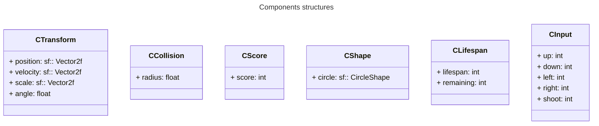

# Assignment 2

Objectif : Tester l'usage du template sur un cas concret.

## Architecture

```
Game
  > Systems (méthodes dans la classe Game)
  > EntityManager
```

## Composants



CInput est attaché au joueur.

Une Entity est n'importe quel objet du jeu :

- Le joueur
- une balle tirée par le joueur
- un ennemi
- un petit ennemi
- etc.


## Game

Toutes les fonctions systèmes sont définies dans la class `Game` :

- void sMovement()
- void sUserInput()
- void sEnemySpawner()
- void sCollision()
- void sRender()

Cette classe contient de code de gameplay.

## Le jeu

Le jeu doit faire :

- Créer les objets du jeu sous forme d'entités
- Ajouter les composants aux entités
- Implémenter le gameplay via les fonctions système (y.c. gérer les entrées utilisateur)
- Mettre en pause le jeu / quitter le jeu
- Peu initialiser / charger une configuration depuis un fichier

Les limitations :

- On se limite à une Scène (Pas de menu par exemple)
- On ne charge aucun asset (pas de texture, pas de son, etc.)
- On ne fait pas d'animation avec des textures
- On ne fait aucun menu / interface

## Spécifications

Joueur :

- [x] Le joueur est représenté par une forme qui est définie dans le fichier de configuration.
- [ ] Le joueur doit apparaitre au centre de l'écran au début du jeu, et lorsqu'il meurt (lorsqu'il entre en
  collision avec un ennemi).
- [x] Le joueur se déplace avec une vitesse déterminée dans le fichier de configuration dans les 4 directions
  suivantes :
    + Haut : Touche Z
    + Gauche : Touche Q
    + Bas : Touche S
    + Droite : Touche D
- [x] Les mouvements du joueur sont confinés dans les limites de la fenêtre.
- [x] Le joueur peut tirer une balle dans la direction de la souris lors qu'un clic gauche est réalisé. La vitesse,
  la taille et la durée de vie des balles sont défini dans le fichier de configuration

Ennemis :

- [x] Les ennemis apparaissent à une position aléatoire à l'écran toutes les X frames. X étant dans le fichier de
  configuration.
- [x] Les ennemis ne doivent pas déborder de l'écran lorsqu'ils apparaissent.
- [x] La forme des ennemis a un nombre aléatoire de vertices entre une valeur minimale et une valeur maximale
  définie dans le fichier de configuration.
- [x] Le radius de la forme d'un ennemi (sa taille) est spécifiée dans le fichier de configuration.
- [x] Les ennemis se voient attribuées une couleur aléatoire lorsqu'ils apparaissent.
- [x] Les ennemis se voient attribuées une vitesse aléatoire lorsqu'ils apparaissent entre une valeur minimale et
  une valeur maximale spécifiée dans le fichier de configuration.
- [ ] Lorsqu'un ennemi atteint le bord de la fenêtre, il rebondit dans la direction opposée à la même vitesse.
- [ ] Lorsqu'un grand ennemi entre en collision avec une balle ou le joueur, ils sont détruit et N petits ennemis
  apparaissent à la place. N est le nombre de vertices de l'ennemi original. Chaque petit ennemi doit avoir
  le même nombre de vertices et la même couleur que l'ennemi original. Les petits ennemis sont propagés à chaque
  angle de l'ennemie original.

Score :

- [ ] À chaque fois qu'un ennemi apparait, il lui ait attribué un score de N*100, où N est le nombre de vertices. Les
  petits ennemis doublent la valeur.
- [ ] Si le joueur tue un ennemi, le score du jeu est incrémenté du score de l'ennemi tué.
- [ ] Le score doit être affiché en haut à gauche de l'écran dans la police de caractères spécifiée dans le fichier de
  configuration.

Dessin :

- [x] Dans le système de rendu, toutes les entités doivent avoir une rotation lente.
- [ ] Une entité avec un Lifespan doit avoir sa couleur du canal alpha positionné à un ratio du temps restant à vivre.

Interface graphique :

- [ ] La GUI doit afficher des options pour stopper chaque fonction système de manière indépendante.
- [ ] Pour chaque entité du jeu, la GUI doit lister l'ID, le Tag et la position de l'entité. La liste de toutes
  les entités doit être affichée. On doit pouvoir visualiser la liste par tag. Il doit y avoir un moyen pour
  supprimer une entité par ce menu.
- [ ] On doit pouvoir changer l'intervalle d'apparition des ennemis.
- [ ] On doit pouvoir faire apparaitre un ennemi depuis la GUI.

Autre :

- [ ] La touche 'P' met en pause le jeu (y.c le Lifespan)
- [ ] La touche 'Esc' permet de quitter le jeu
