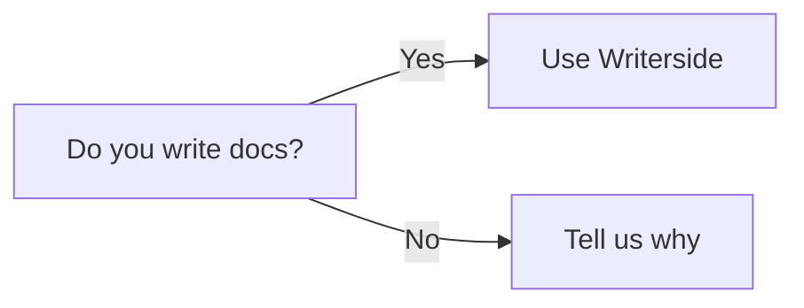
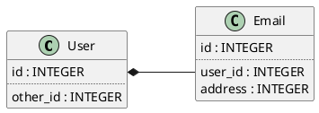

# Game Template

## TODO

- [ ] Organiser les classes
- [ ] Créer la documentation du code
- [ ] Faire le rendu dans un thread
  dédié [Documentation](https://www.sfml-dev.org/tutorials/2.0/window-opengl-fr.php#dessiner-depuis-un-thread)
- [ ] Corriger l'erreur + warning suivant si usage d'OpenGL 4.1 :

        Error. Unable to create the context. Retrying without shared context.
        Warning. New context created without shared context.

## argparse

Cf. [GitHub](https://github.com/p-ranav/argparse).

## SFML

Cf. [Documentation](https://www.sfml-dev.org/documentation/3.0.1/).

### MacOS Installation

Install lib and headers with `brew` :

```sh
brew install sfml
```

And use this CMake template :

*TODO* : To review...

```CMake
cmake_minimum_required(VERSION 3.31)
project(GameTemplate)

set(CMAKE_CXX_STANDARD 23)

# Point the SFML_DIR to your local copy of the framework
set(SFML_DIR "/opt/homebrew/Cellar/sfml/3.0.1")
include_directories(${SFML_DIR}/include)
link_directories(${SFML_DIR}/lib)
add_definitions(-DSFML_STATIC)

add_executable(GameTemplate main.cpp)

target_link_libraries(${PROJECT_NAME} sfml-graphics sfml-audio sfml-system sfml-window)
```

## ImGui

Add submodule :

```bash
mkdir external
git submodule add git@github.com:ocornut/imgui.git ./external/imgui
```

## ImGui SFML

Add submodule :

```bash
mkdir external
git submodule add git@github.com:SFML/imgui-sfml.git ./external/imgui-sfml
```

ImGui SFML CMake compliant. We just need to use it !

Add this to our `CMakeLists.txt` file :

```CMake

```

## CMake tutorial

Cf. [Tutorial](https://edw.is/using-cmake/).

## Tuto SFML RPG

Cf. [YouTube](https://www.youtube.com/playlist?list=PL6xSOsbVA1ebkU66okpi-KViAO8_9DJKg).


## Création des sprites

J'utilise cet outil [en ligne](https://www.piskelapp.com/p/create/sprite/)


Là où j'en suis :
https://www.youtube.com/watch?v=PlVXuqQ-540&list=PL6xSOsbVA1ebkU66okpi-KViAO8_9DJKg&index=54

https://www.sfml-dev.org/documentation/3.0.1/classsf_1_1Sprite.html


## Level supérieur

Une fois que je me serais familiarisé avec la série YouTube, il faudra voir :

1) Série de [Dave Churchill](https://www.youtube.com/watch?v=Eoq12SNaWI8&list=PL_xRyXins84_Sq7yZkxGP_MgYAH-Zo8Uu)

2) Puis cet [article](https://austinmorlan.com/posts/entity_component_system/)

3) vraie [implémentation](https://github.com/CppCon/CppCon2015/blob/master/Tutorials/Implementation%20of%20a%20component-based%20entity%20system%20in%20modern%20C%2B%2B/Source%20Code/p7.cpp)

## Tips and Tricks

[Mermaid](https://mermaid.js.org/syntax/classDiagram.html).






